# SWE Lab Backend - Event Management System

[![CI][build-badge]][build-url]
[![TypeScript][typescript-badge]][typescript-url]
[![prettier][prettier-badge]][prettier-url]


Backend application for event management system with focus on best practices:

- Minimal setup that can be extended 🔧
- Spin it up with single command 🌀
- TypeScript first
- RESTful APIs
- JWT authentication with role based authorization
- Event management with speaker functionality
- Event registration system with relational data

## Implemented Entities

### Event

Represents an event that can be created by speakers. Fields include:

- `id` (UUID)
- `speaker_id` (UUID, references User)
- `name` (string)
- `is_online` (boolean)
- `event_date` (timestamp)
- `location` (string, nullable)
- `link` (string, nullable)
- `description` (text, nullable)
- `image_urls` (text array, nullable)
- `tags` (text array, nullable)
- `limit_participants` (integer, nullable)
- `created_at` (timestamp)

**Relations:**

- ManyToOne with User (speaker)
- OneToMany with EventRegistration

### EventRegistration

Represents a user's registration for an event. Composite primary key: (event_id, user_id).

- `event_id` (UUID)
- `user_id` (UUID)
- `comment` (text, nullable)
- `created_at` (timestamp)

**Relations:**

- ManyToOne with Event
- ManyToOne with User

## API Endpoints

### Events API (`/v1/events`)

| Method   | Endpoint         | Auth Required | Description                     | Returns Relations                    |
| -------- | ---------------- | ------------- | ------------------------------- | ------------------------------------ |
| `GET`    | `/v1/events`     | No            | Get all events                  | ✅ Speaker, Registrations            |
| `GET`    | `/v1/events/:id` | No            | Get event by ID                 | ✅ Speaker, Registrations with Users |
| `POST`   | `/v1/events`     | Yes (JWT)     | Create new event (speaker only) | Event details                        |
| `PATCH`  | `/v1/events/:id` | Yes (JWT)     | Update event (speaker only)     | Event details                        |
| `DELETE` | `/v1/events/:id` | Yes (JWT)     | Delete event (speaker only)     | Success message                      |

### Event Registrations API (`/v1/event-registrations`)

| Method   | Endpoint                            | Auth Required | Description               | Returns Relations |
| -------- | ----------------------------------- | ------------- | ------------------------- | ----------------- |
| `GET`    | `/v1/event-registrations`           | Yes (JWT)     | Get user's registrations  | ✅ Event, User    |
| `GET`    | `/v1/event-registrations/:event_id` | Yes (JWT)     | Get specific registration | ✅ Event, User    |
| `POST`   | `/v1/event-registrations`           | Yes (JWT)     | Register for event        | ✅ Event, User    |
| `PATCH`  | `/v1/event-registrations/:event_id` | Yes (JWT)     | Update registration       | ✅ Event, User    |
| `DELETE` | `/v1/event-registrations/:event_id` | Yes (JWT)     | Cancel registration       | Success message   |

## API Testing Screenshots

### Login as Speaker

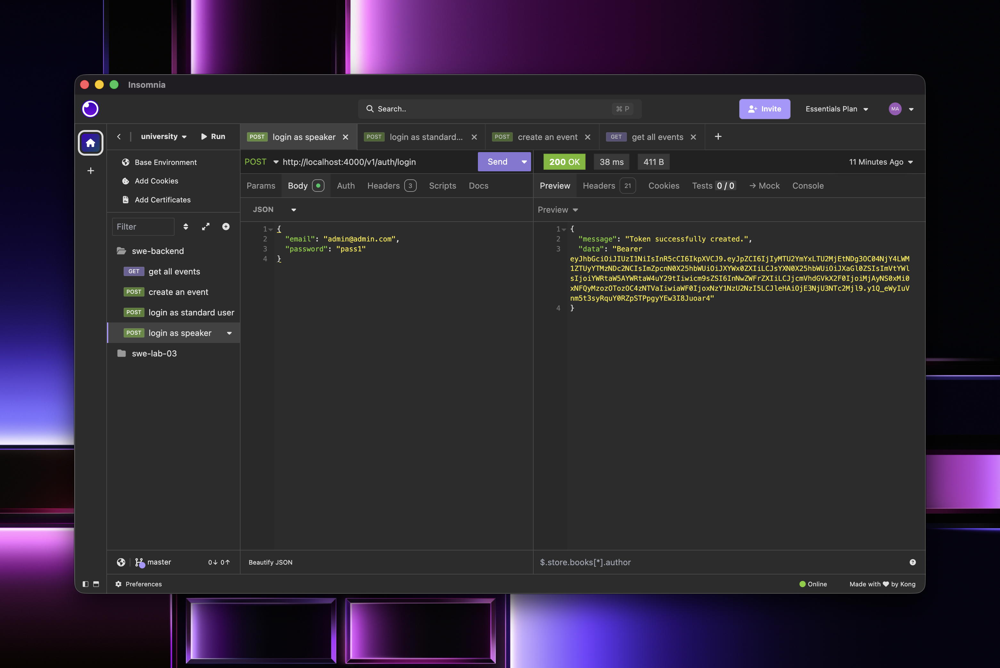

### Login as Standard User

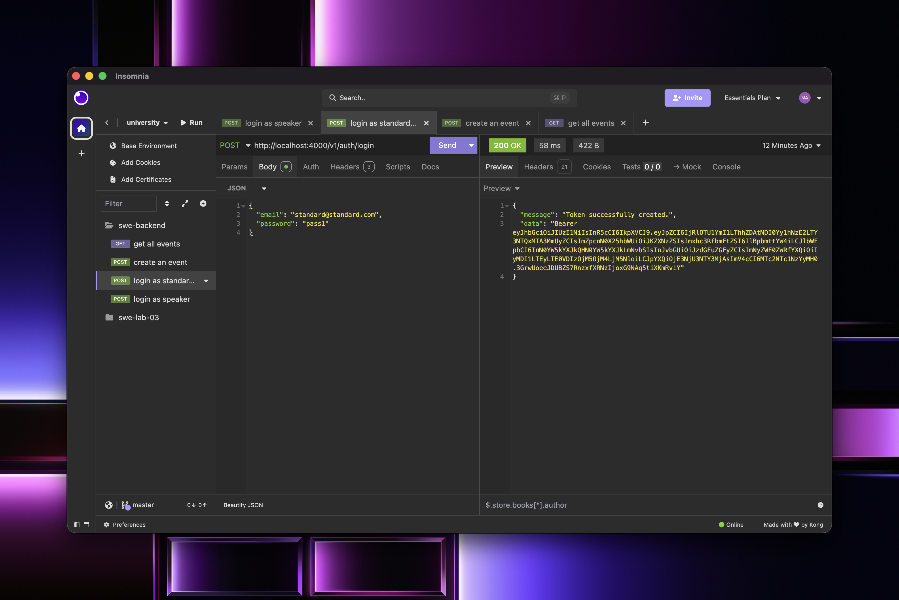

### Create Event (Speaker Only)

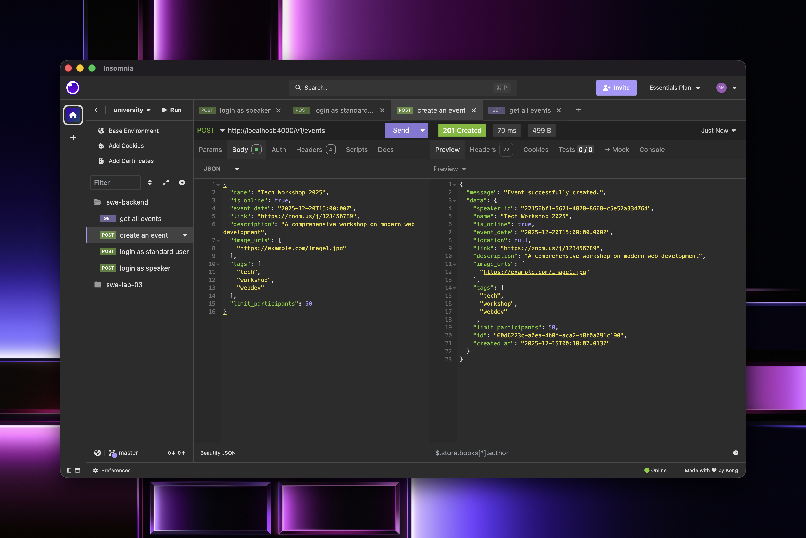

### Get All Events

Shows speaker relation via JOIN.
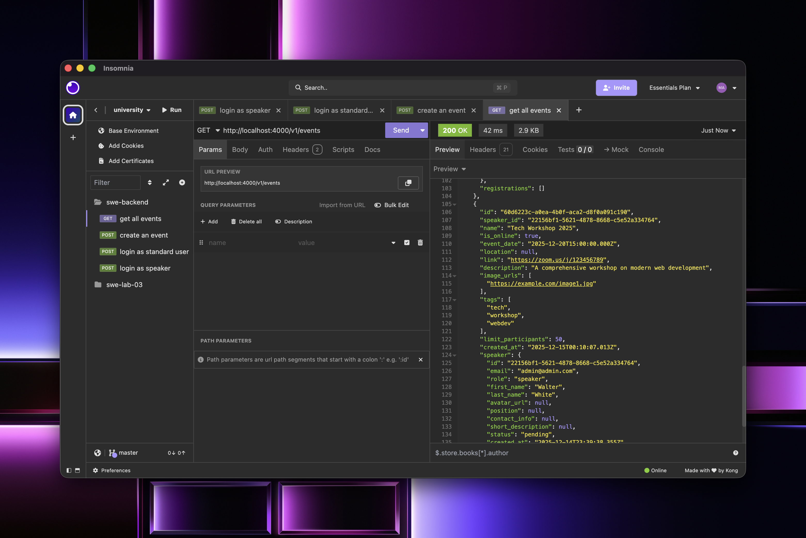

### Get Event by ID

Shows speaker and registrations with nested users via JOIN.
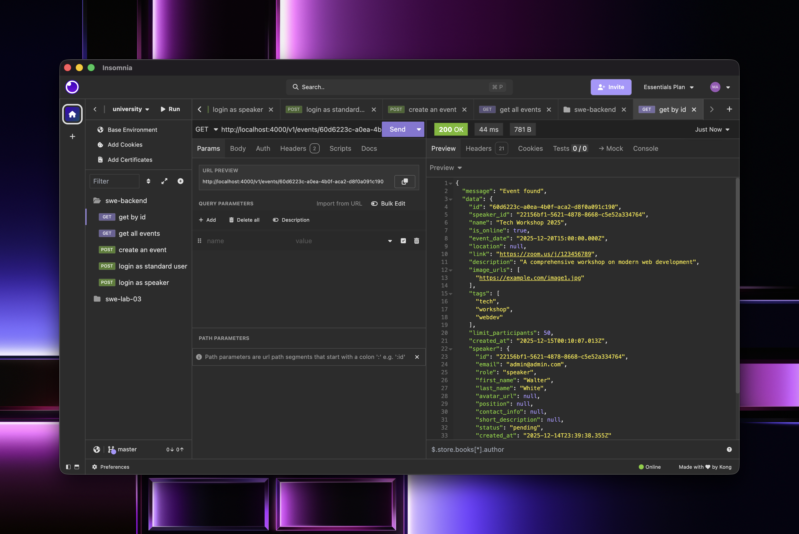

### Register for Event

Shows event and user relations via JOIN.
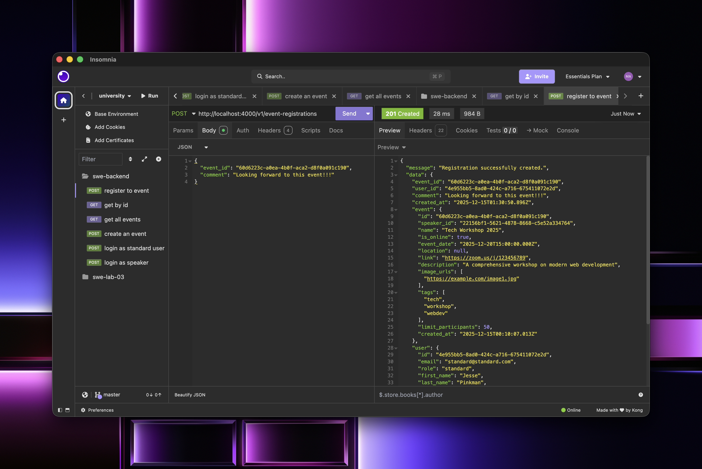

### Get All User Registrations

Shows all user's registrations with event and user relations.


### Update Registration Comment

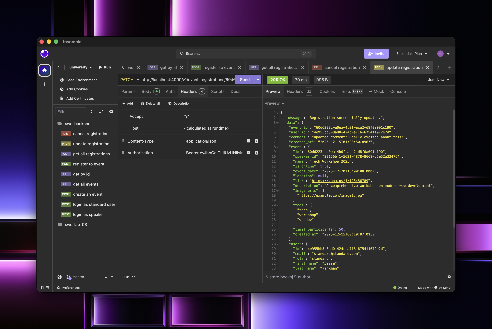

### Cancel Registration

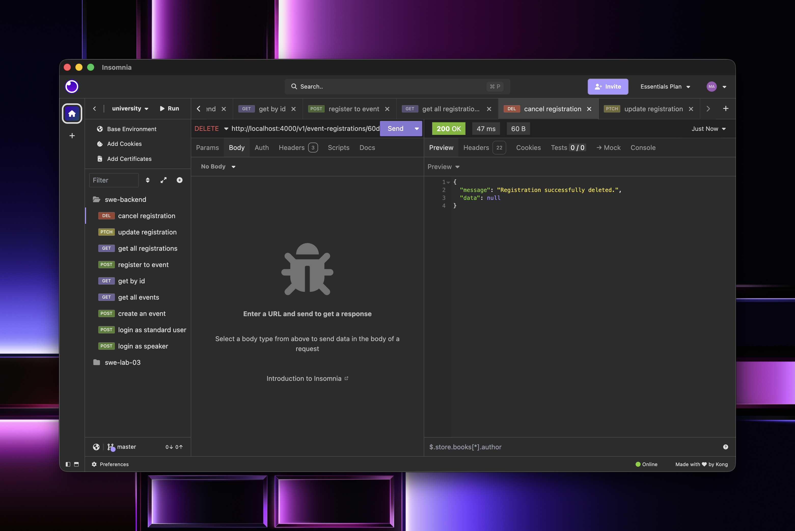

### Delete Event (Speaker Only)

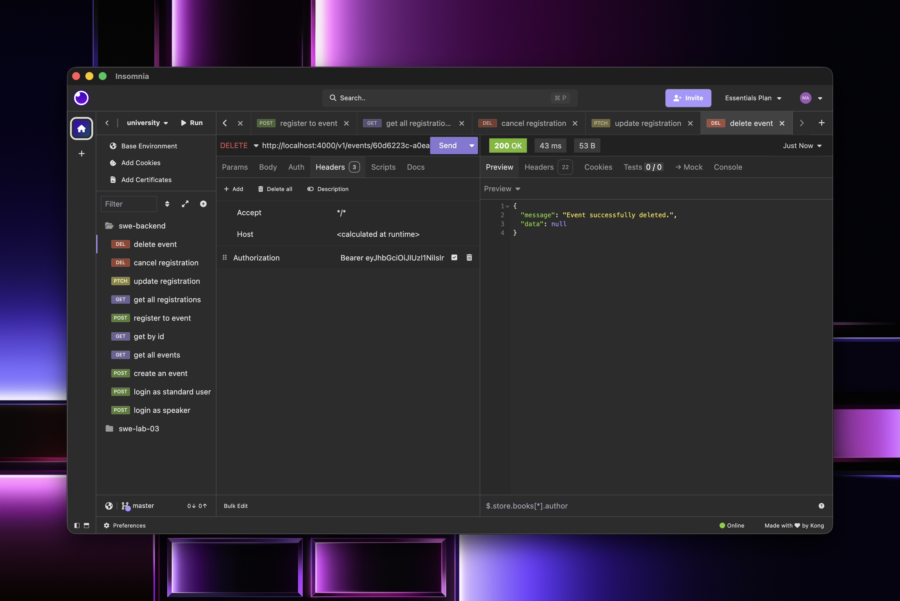

## Architecture

This project follows the **Separation of Concerns** principle with a layered architecture:

```
Request → Middleware (Validation) → Controller → Service → Repository → Database
```

### Layers

| Layer          | Responsibility                                                                       |
| -------------- | ------------------------------------------------------------------------------------ |
| **Middleware** | Validates incoming request data using `validator` library before reaching controller |
| **Controller** | Orchestrates request handling, calls service methods, transforms entities to DTOs    |
| **Service**    | Contains business logic, interacts with repository, throws domain errors             |
| **Repository** | Direct database access via TypeORM                                                   |

### Architecture Screenshots

#### Validation Error (400 Bad Request)

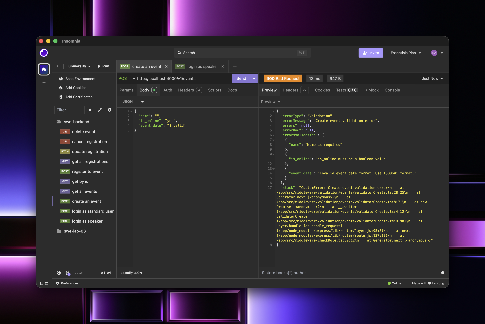

#### Successful Event Creation with DTO Response

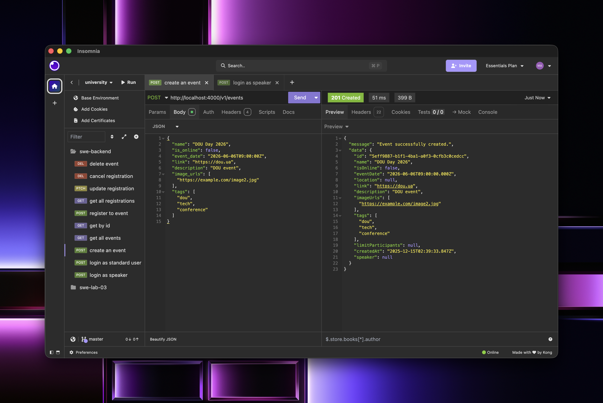

#### Get All Events - DTO Response Structure

Shows transformed response with nested speaker and registrations:

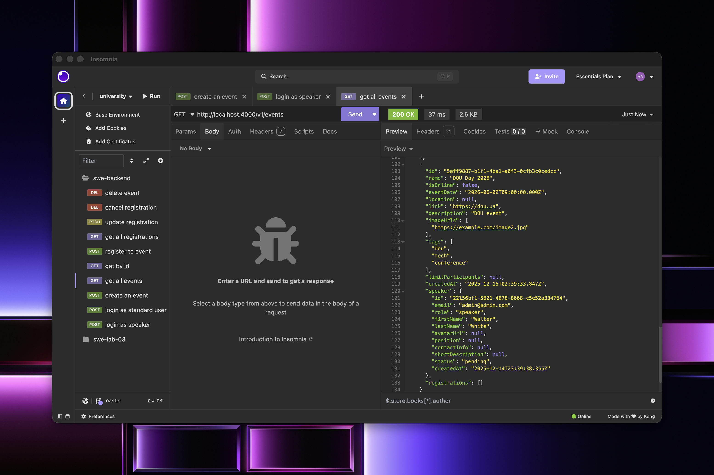

## Requirements

- [Node v16+](https://nodejs.org/)
- [Docker](https://www.docker.com/)

## Running

_Easily set up a local development environment with single command!_

- clone the repo
- `npm run docker:dev` 🚀

Visit [localhost:4000](http://localhost:4000/) or if using Postman grab [config](/postman).

### _What happened_ 💥

Containers created:

- Postgres database container seeded with 💊 Breaking Bad characters in `Users` table (default credentials `user=walter`, `password=white` in [.env file](./.env))
- Node (v16 Alpine) container with running boilerplate RESTful API service
- and one Node container instance to run tests locally or in CI

## Features:

- [Express](https://github.com/expressjs/express) framework
- [TypeScript v4](https://github.com/microsoft/TypeScript) codebase
- [TypeORM](https://typeorm.io/) using Data Mapper pattern
- [Docker](https://www.docker.com/) environment:
  - Easily start local development using [Docker Compose](https://docs.docker.com/compose/) with single command `npm run docker:dev`
  - Connect to different staging or production environments `npm run docker:[stage|prod]`
  - Ready for **microservices** development and deployment.  
    Once API changes are made, just build and push new docker image with your favourite CI/CD tool  
    `docker build -t <username>/api-boilerplate:latest .`  
    `docker push <username>/api-boilerplate:latest`
  - Run unit, integration (or setup with your frontend E2E) tests as `docker exec -ti be_boilerplate_test sh` and `npm run test`
- Contract first REST API design:
  - never break API again with HTTP responses and requests payloads using [type definitions](./src/types/express/index.d.ts)
  - Consistent schema error [response](./src/utils/response/custom-error/types.ts). Your frontend will always know how to handle errors thrown in `try...catch` statements 💪
- JWT authentication and role based authorization using custom middleware
- Set local, stage or production [environmental variables](./config) with [type definitions](./src/types/ProcessEnv.d.ts)
- Logging with [morgan](https://github.com/expressjs/morgan)
- Unit and integration tests with [Mocha](https://mochajs.org/) and [Chai](https://www.chaijs.com/)
- Linting with [ESLint](https://eslint.org/)
- [Prettier](https://prettier.io/) code formatter
- Git hooks with [Husky](https://github.com/typicode/husky) and [lint-staged](https://github.com/okonet/lint-staged)
- Automated npm & Docker dependency updates with [Renovate](https://github.com/renovatebot/renovate) (set to patch version only)
- Commit messages must meet [conventional commits](https://www.conventionalcommits.org/en/v1.0.0/) format.  
  After staging changes just run `npm run commit` and get instant feedback on your commit message formatting and be prompted for required fields by [Commitizen](https://github.com/commitizen/cz-cli)

## Other awesome boilerplates:

Each boilerplate comes with it's own flavor of libraries and setup, check out others:

- [Express and TypeORM with TypeScript](https://github.com/typeorm/typescript-express-example)
- [Node.js, Express.js & TypeScript Boilerplate for Web Apps](https://github.com/jverhoelen/node-express-typescript-boilerplate)
- [Express boilerplate for building RESTful APIs](https://github.com/danielfsousa/express-rest-es2017-boilerplate)
- [A delightful way to building a RESTful API with NodeJs & TypeScript by @w3tecch](https://github.com/w3tecch/express-typescript-boilerplate)

[build-badge]: https://github.com/mkosir/express-typescript-typeorm-boilerplate/actions/workflows/main.yml/badge.svg
[build-url]: https://github.com/mkosir/express-typescript-typeorm-boilerplate/actions/workflows/main.yml
[typescript-badge]: https://badges.frapsoft.com/typescript/code/typescript.svg?v=101
[typescript-url]: https://github.com/microsoft/TypeScript
[prettier-badge]: https://img.shields.io/badge/code_style-prettier-ff69b4.svg
[prettier-url]: https://github.com/prettier/prettier

## Contributing

All contributions are welcome!
